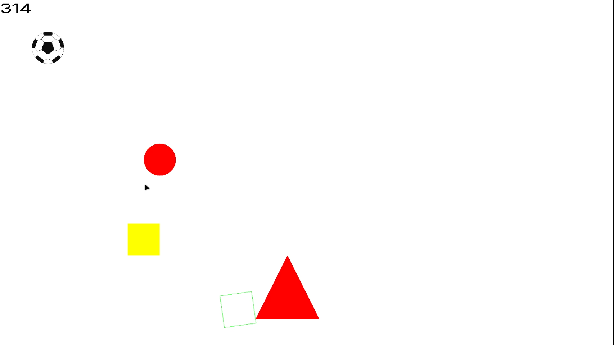

# Warp Engine

Warp Engine is a simple 2D game engine made with SDL2.

## Features

- Object system
- Component system
- Object hierarchy
- Scenes

### Availible components

- Rectangle
- FilledRectangle
- Ellipse 
- FilledEllipse
- Triangle
- FilledTriangle
- BoxCollider
- CharacterController
- Text
- Button
- Image

## Screenshots

## TODO List

You can find TODO list [here](https://cloud.natesworks.com/index.php/s/4SMJ5zXxezTAy4R)